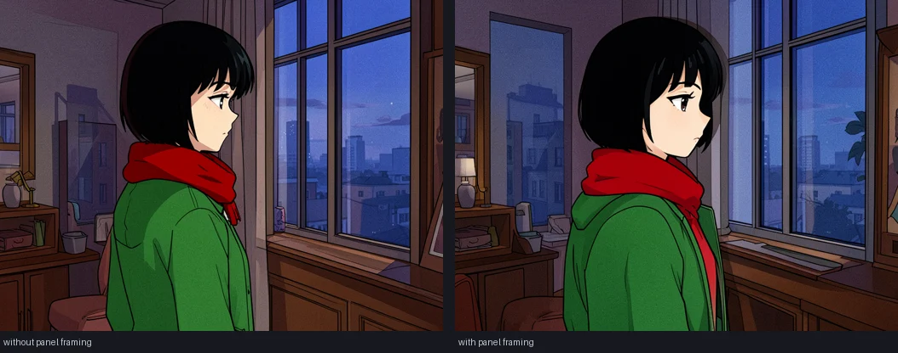

# What this machine actually does

Measured on a 16 GB M4, not estimated. Recorded so the same questions are not
argued from intuition a second time.

## Generation

| Task | Model | Settings | Time |
|---|---|---|---|
| Text to image | FLUX.2 Klein 4B q4 | 512², 4 steps | 51 s |
| Reference panel | FLUX.2 Klein 4B q4 | 512², 4 steps, 1 reference | 44–46 s |
| Reference panel, photoreal | FLUX.2 Klein 4B q4 | 512², 4 steps, 1 reference | 139–144 s |
| Upscale 2× | SeedVR2 3B q4 | 256×160 → 512×320 | 6.2 s |
| Model load | FLUX.2 Klein 4B q4 | — | 2.4 s |

## Image to video

Wan 2.2 TI2V-5B q8, `AbstractFramework/wan2.2-ti2v-5b-diffusers-8bit`, on this
16 GB machine, starting from a still:

| Clip | Steps | Peak | Load | Generate | Wall |
|---|---|---|---|---|---|
| 320x192, 9 frames | 8 | 9.72 GiB | 3.1 s | 24.2 s | 34 s |
| 480x320, 17 frames | 12 | did not complete | 3.2 s | ~90 s/step, paging | stopped at step 10 |

9.72 GiB against a 12 GiB budget, so the small size fits with room. The larger
one reached step 10 of 12 while paging heavily and was stopped; it is not known
whether it completes.

## Video: it was the resolution all along

Wan 2.2 TI2V-5B q8, text to video, 20 steps, 9 frames, same seed and prompt:

| Size | flow_shift | low-RAM flags | Peak | Time | Result |
|---|---|---|---|---|---|
| 320x192 | none | on | 9.72 GiB | 126 s | coloured noise |
| 320x192 | none | **off** | 13.40 GiB | 273 s | coloured noise |
| 320x192 | 3.0 | on | 9.72 GiB | 126 s | coloured noise |
| **704x384** | **5.0** | on | **10.20 GiB** | 1571 s | **a correct picture** |

The model is trained at 1280x704 and cannot be driven at a quarter of that
width. It does not degrade gracefully below some floor; it stops converging
and returns colour. Every clip this app has produced was made at 320x192.

The three explanations that were carried for days are all wrong, and each was
eliminated by a controlled run. It is not the first-frame conditioning: text
to video, with no image at all, failed identically. It is not the step count:
fifty steps -- the model's own figure -- was still noise at 320x192. It is not
the low-RAM flags: turning all three off changed nothing except raising peak
memory from 9.72 to 13.40 GiB, which means they work and should stay.

The part worth remembering: **resolution was never the memory constraint it
was assumed to be.** 704x384 is 4.4 times the pixels of 320x192 and costs
0.5 GiB more -- 10.20 against 9.72. What it costs is time, 1571 seconds
against 126. The catalog's invented 103.7 GiB peak is what sent everything to
a tiny canvas in the first place, and that canvas was the bug. The
optimisation caused the failure it was meant to avoid.

### Superseded: what was believed before the resolution run

Everything below this heading was written before 640x368 was tried, and its
conclusion is wrong. It is kept because the wrong hypotheses are the reason
the right test took so long to run.

**Text to video is broken too, not just image to video.** At the model's own
recommended 50 steps, with no image involved at all, 838 seconds of denoising
produced the same coloured noise. Two different models -- Wan TI2V-5B and
Bernini-R -- fail identically, and both go through `op_video`.

That eliminates the two obvious explanations. It is not the first-frame
conditioning, because one run used no image. It is not the step count, because
50 is what the model asks for. What remains is the engine's own call -- three
low-RAM flags passed on every video run -- or the q8 checkpoint, which logs
`Normalizing Wan q8 runtime-sensitive paths to BF16 at load` and silently
rewrites attention weights.

Neither. Both runs were at 320x192, and that was the whole of it. The flags
and the checkpoint were never the problem, and Bernini-R's verdict was formed
at a size no Wan-family model converges at, so it is not known to be broken
either -- it is untested.

Every technical check passes on the broken output: valid MP4, correct
dimensions, correct frame count, correct fps, sealed to the vault without
complaint. That is exactly why it was reported as working.

**The output was not usable.** Every frame of the completed clip came back as
coloured noise with no resemblance to the source picture. Memory, timing and
the seal were all verified and all fine, and the clip was reported as working
on that basis without anyone looking at the frames -- which is the same mistake
as the 103.7 GiB figure: a number that was true about the wrong thing.

The settings are the likely cause and were far outside what the model asks for:

| | asked for | run at |
|---|---|---|
| width x height | 1280x704 | 320x192 |
| frames | 81 | 9 |
| steps | 50 | 8 |

Eight steps cannot finish denoising, and 320x192 leaves a latent grid of about
20x12, which is very small for a model trained at sixty times that area. Both
need testing before this is called working. Fifty steps at a usable size is
minutes per clip on this machine, so the open question is whether any setting
is both good enough to watch and fast enough to wait for.

The catalog previously claimed **103.7 GiB** for this model with
`peak_estimated: false`, which marked it hopeless and hid the only working
image-to-video model on this machine. That figure was for the model's
recommended 1280x704x81 and had never been measured here. Attention is
quadratic in sequence length and the latent sequence at 320x192x9 is roughly
sixty times shorter, so almost all of it disappears.

The text encoder is the largest single component at 10.58 GiB, against a 5.03
GiB transformer and a 1.31 GiB VAE. It is released before denoising --
`keep_text_encoder_resident` defaults to `False`, which is what makes the model
fit. `release_text_encoder`, which the engine passes, is not a parameter this
route accepts and is dropped with a warning; the default already does the right
thing.

## The runtime cannot be resolved, only locked

`mlx-gen 0.36.0` requires `mlx<0.32.0` on darwin. `mlx-vlm 0.7.0` requires
`mlx>=0.32.2`. No version of mlx satisfies both, and every mlx-vlm from 0.6.9
onward wants 0.32 or newer, so there is no pairing that resolves.

The environment works anyway, and has all along, because the picture reader and
the generator never share a process — the engine loads one, unloads it, then
loads the other. A partially pinned install never asked pip to check, so nobody
noticed.

Pinning the set exactly and letting pip resolve it turned a working arrangement
into `ResolutionImpossible`, and first-run setup failed with no environment at
all. The lock names every transitive package, so it is installed with
`--no-deps`: there is nothing to resolve, and the file is the whole truth.

Worth stating plainly because it will look like a mistake to the next person:
the two constraints really are incompatible, and pip really is right.

## Panels have to be asked to be panels

FLUX.2 Klein 4B q4, 768×576, 4 steps, same seed, same style words:

| Prompt | Result |
|---|---|
| style + shot + subject + action + setting | a standalone illustration: centred, resolved, softly rendered |
| the same, plus "a single comic book panel, sequential art, cropped composition" | flat colour, hard shadow shapes, clean linework, screentone — reads as a panel |

Adding the framing is what makes the style land. Before it, "cel-shaded anime"
produced a nicely rendered picture that was not a comic panel, and the finished
pages only looked like comics because the compositor drew the borders and set
the captions afterwards.

The same test found a trap. The first version of the framing ended with "no
border, no text, no speech bubbles, no caption", and the model **drew a heavy
black border** — inside the border the compositor then drew around it. Klein
runs at a guidance of 1 and has no negative conditioning, so "no border" is
read as the word "border". The way not to get one is never to mention it;
"full bleed artwork" asks for the same thing positively.

## Upscale memory, and why it crashed the engine

SeedVR2 3B q4, MLX cache limit 1 GiB, one pass, on this 16 GB machine:

| Output | Peak memory | Time | Fits in the 12 GiB budget? |
|---|---|---|---|
| 512×512 | 6.43 GiB | 27 s | yes |
| 768×768 | 10.44 GiB | 64 s | yes |
| 1024×1024 | 16.57 GiB | 173 s | **no** |

Peak tracks output area linearly across that range:

    peak GiB = 3.06 + 12.88 x output-megapixels

which holds to within 0.25 GiB at all three points. At a 12 GiB budget that
caps a single pass near **833 pixels on the longest edge** — less than the
source for any picture worth enlarging, which is why one pass is not enough.

Going over does not raise a Python error. MLX reports the Metal failure from a
command-buffer completion handler, which cannot raise into Python: the C++
exception reaches `std::terminate` and aborts the whole engine, so the app only
sees "the engine stopped unexpectedly". It has to be refused before dispatch.

Tiled, the same work fits and finishes:

| Output | Tiles | Peak memory | Time |
|---|---|---|---|
| 1024×1024 | 2×2 at 372 px source | 10.11 GiB | 85–118 s |

Seams were checked on a smooth source, where any gradient spike can only be a
join: worst 2.73 against a median of 0.63, about 1% of the 0–255 range. Not
visible. The earlier measurement in the generation table (256×160 → 512×320,
6.2 s) was the only one ever taken, and being that small is exactly why the
ceiling went unnoticed.

Photoreal panels came out roughly three times slower than stylised ones in the
same session, but the machine had been downloading and building for hours by
then, so treat that ratio as unconfirmed rather than a property of the style.

## Prompt work

| Task | Model | Time |
|---|---|---|
| Clarify a prompt | Qwen3-4B-Instruct 4bit | ~2 s |
| Clarify a prompt | Qwen2-VL-2B 4bit | 6–12 s, and wrong |
| Story to 4-panel shot list | Qwen3-4B-Instruct 4bit | 43–51 s |
| Story to 4-panel shot list | Qwen2-VL-2B 4bit | fails: returns 1–2 panels, skips the story |

## LoRA training — works, but not on this machine

`mflux-train` trains LoRA adapters for `flux2` and `z_image`. It runs here and
produces a valid checkpoint. It is not practical:

    6 steps, 512px, rank 16, Klein 4B q4, --low-ram
    13 min 03 s total, mean 130.5 s/step, 41% CPU
    per-step degraded 91.9 s -> 148.2 s as the machine heated

Extrapolated, a real character adapter costs:

| Steps | At the mean | At the degraded rate |
|---|---|---|
| 100 | 3.6 h | 4.1 h |
| 200 | 7.2 h | 8.2 h |
| 500 | 18.1 h | 20.6 h |

The literature puts a trained LoRA ahead of every reference-image trick for
character identity, so this is the better answer in principle. At seven hours
per character it is not the answer here. Multi-reference conditioning costs
45 s per panel and needs no training, which is why the picture-board pipeline
uses it.

Two traps found on the way, in case anyone retries this:

- LoRA target paths are per-architecture. FLUX.2 has two block types with
  different shapes: `transformer_blocks.{n}.attn.to_q` on the double-stream
  blocks, and `single_transformer_blocks.{n}.attn.to_qkv_mlp_proj` on the
  single-stream ones, which fuse qkv and the MLP into one projection. The
  `layers.{n}.attention.to_q` paths in the shipped example are z-image's.
- Klein 4B is distilled and rejects guidance above 1.0, but the training
  preview generator asks for its own. Omit `monitoring` from the config
  entirely, or previews fail before the first step runs.

## What a video model costs

No image-to-video model both fits this machine and produces a usable clip:

- Wan 2.1 VACE 1.3B — fits, but transforms existing footage and takes no still
  image at all. Verified: it raises on `image_path`.
- Wan 2.2 TI2V-5B — takes a still and **does fit**: 9.72 GiB measured for a
  complete run. The clip came back as noise. See the section above.
- MiniMax-H3 — has proper first-frame animation, 464 GiB repo.
- Bernini-R 1.3B — fits and takes a still. Tried; the result was poor.

Video models also want more canvas than fits. VACE is trained at 832×480,
Bernini outputs 480p, and TI2V-5B asks for 1280×704 — while the runs that fit
were measured at 320×192. Running at a quarter of the trained width is its own
quality problem, and the TI2V result suggests it is the dominant one.
